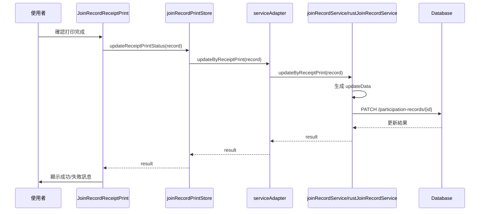

# 收據打印狀態更新功能

## 功能概述

當使用者確認收據已打印完成後，系統會自動更新參加記錄的收據相關欄位。

## 資料庫欄位

在 `participationRecordDB` 表中的收據相關欄位：

| 欄位名稱          | 類型         | 預設值  | 說明           |
| ----------------- | ------------ | ------- | -------------- |
| `needReceipt`     | varchar(255) | 'false' | 是否需要收據   |
| `receiptNumber`   | varchar(255) | null    | 收據編號       |
| `receiptIssued`   | varchar(255) | 'false' | 收據是否已開立 |
| `receiptIssuedAt` | varchar(255) | null    | 收據開立時間   |
| `receiptIssuedBy` | varchar(255) | null    | 收據開立者     |

## 實現架構

### 1. Service 層

#### joinRecordService.js

```javascript
async updateByReceiptPrint(record) {
  if (!record?.id) {
    return { success: false, message: "缺少記錄 ID" };
  }

// 根據活動類型決定是否需要收據
    const isNeedReceipt =
      record.activeTemplate === "standard" || record.activeTemplate === "stamp";

  const updateData = {
    //needReceipt: isNeedReceipt ? "true" : "false" || "false", // 預設為 "false"
      needReceipt: record.activeTemplate, // 直接使用 activeTemplate 的值來區分不同的收據需求
    receiptNumber: `${record.id}A${record.activityId}R${record.registrationId}`,
    receiptIssued: "true",
    receiptIssuedAt: DateUtils.getCurrentISOTime(),
      //receiptIssuedBy: authService.getCurrentUser(),
      receiptIssuedBy: authService.getUserName() || "沒有名稱", // 確保有名稱可用，否則使用預設值
  };

  return await this.updateParticipationRecord(record.id, updateData);
}
```

#### rustJoinRecordService.js

```javascript
async updateByReceiptPrint(record, context = {}) {
  if (!record?.id) {
    return { success: false, message: "缺少記錄 ID" };
  }

  // 根據活動類型決定是否需要收據
    const isNeedReceipt =
      record.activeTemplate === "standard" || record.activeTemplate === "stamp";

  const updateData = {
    //needReceipt: isNeedReceipt ? "true" : "false" || "false", // 預設為 "false"
      needReceipt: record.activeTemplate, // 直接使用 activeTemplate 的值來區分不同的收據需求
    receiptNumber: `${record.id}A${record.activityId}R${record.registrationId}`,
    receiptIssued: "true",
    receiptIssuedAt: DateUtils.getCurrentISOTime(),
      //receiptIssuedBy: authService.getCurrentUser(),
      receiptIssuedBy: authService.getUserName() || "沒有名稱", // 確保有名稱可用，否則使用預設值
  };

  return await this.updateParticipationRecord(record.id, updateData, {
    operation: "updateByReceiptPrint",
    ...context,
  });
}
```

### 2. Adapter 層

在 `serviceAdapter.js` 中註冊方法：

```javascript
const joinRecordMethods = [
  // ...其他方法
  "updateByReceiptPrint",
  // ...
];
```

### 3. Store 層

#### joinRecordPrintStore.js

```javascript
import { defineStore } from "pinia";
import { serviceAdapter } from "../adapters/serviceAdapter.js";

export const useJoinRecordPrintStore = defineStore("joinRecordPrint", {
  state: () => ({
    isUpdating: false,
    lastUpdateResult: null,
  }),

  actions: {
    async updateReceiptPrintStatus(record) {
      this.isUpdating = true;
      this.lastUpdateResult = null;

      try {
        // 如果 record 中 receiptIssuedAt, receiptIssuedBy 已經有值，則不再更新
        if (record.receiptIssuedAt && record.receiptIssuedBy) {
          this.lastUpdateResult = {
            success: true,
            message: "收據打印狀態已存在，無需更新",
          };
          return this.lastUpdateResult;
        }

        const result = await serviceAdapter.updateByReceiptPrint(record);
        this.lastUpdateResult = result;
        return result;
      } catch (error) {
        console.error("更新收據打印狀態失敗:", error);
        this.lastUpdateResult = {
          success: false,
          message: error.message || "更新失敗",
        };
        return this.lastUpdateResult;
      } finally {
        this.isUpdating = false;
      }
    },

    resetState() {
      this.isUpdating = false;
      this.lastUpdateResult = null;
    },
  },
});
```

### 4. View 層

#### JoinRecordReceiptPrint.vue

```javascript
import { useJoinRecordPrintStore } from "../stores/joinRecordPrintStore.js";

const printStore = useJoinRecordPrintStore();

const handlePostPrintCheck = () => {
  ElMessageBox.confirm("單據是否已成功由打印機完成？", "打印確認", {
    confirmButtonText: "已完成",
    cancelButtonText: "取消打印",
    type: "question",
    center: true,
  })
    .then(async () => {
      // 使用者確認已打印完成，更新打印狀態
      record.value.activeTemplate = activeTemplate.value;
      const result = await printStore.updateReceiptPrintStatus(record.value);

      if (result?.success) {
        ElMessage({
          type: "success",
          message: "已記錄打印完成狀態。",
        });
      } else {
        ElMessage({
          type: "warning",
          message: result?.message || "狀態更新失敗，但打印已完成。",
        });
      }
    })
    .catch(() => {
      ElMessage({
        type: "info",
        message: "若打印失敗，請檢查打印機連線後重試。",
      });
    });
};
```

## 收據編號規則

收據編號格式：`{id}A{activityId}R{registrationId}`

**範例**：

- 參加記錄 ID: 123
- 活動 ID: 1
- 登記 ID: 456
- 生成收據編號: `123A1R456`

## 更新流程



## 更新的資料範例

### 更新前

```json
{
  "id": 123,
  "activityId": 1,
  "registrationId": 456,
  "needReceipt": "false",
  "receiptNumber": null,
  "receiptIssued": "false",
  "receiptIssuedAt": null,
  "receiptIssuedBy": null
}
```

### 更新後

```json
{
  "id": 123,
  "activityId": 1,
  "registrationId": 456,
  "needReceipt": "true",
  "receiptNumber": "123A1R456",
  "receiptIssued": "true",
  "receiptIssuedAt": "2026-02-24T20:02:11.594+08:00",
  "receiptIssuedBy": "admin"
}
```

## 錯誤處理

### 1. 缺少記錄 ID

```javascript
if (!record?.id) {
  return { success: false, message: "缺少記錄 ID" };
}
```

### 2. 更新失敗

```javascript
if (result?.success) {
  ElMessage.success("已記錄打印完成狀態。");
} else {
  ElMessage.warning(result?.message || "狀態更新失敗，但打印已完成。");
}
```

### 3. 使用者取消

```javascript
.catch(() => {
  ElMessage.info("若打印失敗，請檢查打印機連線後重試。");
});
```

## 測試要點

1. ✅ 確認打印後資料庫欄位正確更新
2. ✅ 收據編號格式正確
3. ✅ 時間戳記使用 ISO 格式
4. ✅ 正確記錄操作者
5. ✅ 錯誤處理完整
6. ✅ 使用者取消不更新資料
7. ✅ 支援 Directus 和 Rust 雙後端

## 相關文件

- [收據打印功能說明](./dev-joinRecord-receipt-print-guide.md)
- [活動參加記錄系統](./dev-joinRecord-guide.md)
